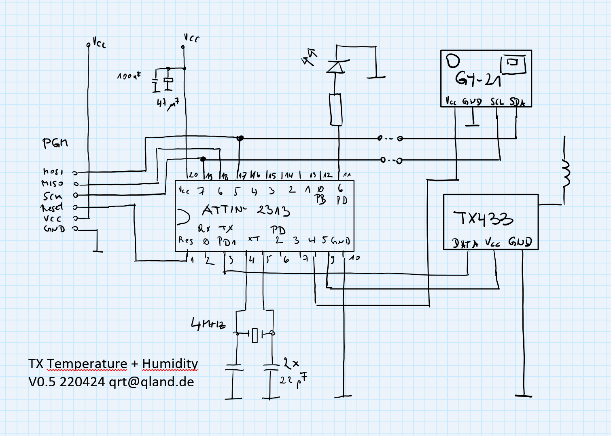

# **miniWeather**

### minimal weather station for temperature, humidity and H2O flooding alarm

 

 

## Features
- high contrast mini OLED display
- low power consumption, long battery life
- (pipe burst) H2O flooding alarm
- receive timeout warning
- receive indication
- short pulse manchester encoded transmission
- reliable checksum validated transmission
- 300 m reach with good receiver (examples: Aurel AC-RX or RX-4M50RR30SF)
- max 4 switchable stations on display
- up to 256 transmitters distinguishable

 

## Links
[-> views](#views)  
[-> source](source)

 

## Schematic
Receiver with OLED display  

Temperature and H2O flooding transmitter  

Temperature and humidity transmitter  

 

---

 

## Views

Makeshift receiver  

 
 

Temperature and H2O flooding transmitter  

 
 

Temperature and H2O flooding transmitter inside  

 
 

H2O sensor  

 
 

Temperature and humidity transmitter  

 
 

 
 

---

[qrt@qland.de](mailto:qrt@qland.de) 220424
